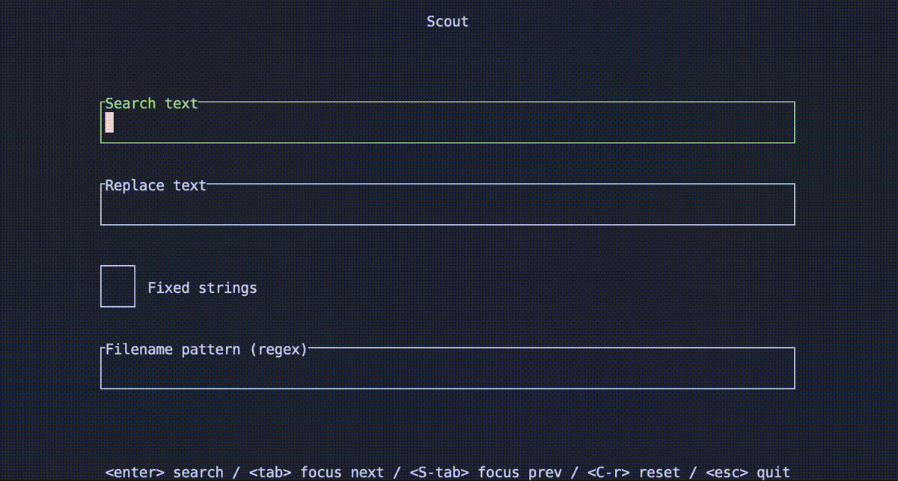

# scooter

Scooter is an interactive find-and-replace terminal UI app.

Search with either a fixed string or a regular expression, enter a replacement, and interactively toggle which instances you want to replace. You can also specify a regex pattern for the file paths you want to search.

If the instance you're attempting to replace has changed since the search was performed, e.g. if you've switched branches and that line no longer exists, that particular replacement won't occur: you'll see all such cases at the end.



## Features

Scooter respects both `.gitignore` and `.ignore` files. By default hidden files (such as those starting with a `.`) are ignored, but can be included with the `--hidden` flag.

You can add capture groups to the search regex and use them in the replacement string: for instance, if you use `(\d) - (\w+)` for the search text and `($2) "$1"` as the replacement, then `9 - foo` would be replaced with `(foo) "9"`.

## Usage

Run

```sh
scooter
```

in a terminal to launch Scooter. By default the current directory is used to search and replace in, but you can pass in a directory as the first argument to override this behaviour:

```sh
scooter ../foo/bar
```

A set of keymappings will be shown at the bottom of the window: these vary slightly depending on the screen you're on.

### Search fields

When on the search screen the following fields are available:

- **Search text**: Text to search with. Defaults to regex, unless "Fixed strings" is enabled, in which case this reverts to case-sensitive string search.
- **Replace text**: Text to replace the search text with. If searching with regex, this can include capture groups.
- **Fixed strings**: If enabled, search with plain case-sensitive strings. If disabled, search with regex.
- **Path pattern (regex)**: Regex pattern that file paths must match. The relative path of the file is matched against: for instance, if searching in `/foo/`, if the path pattern is set to `bar` then `/foo/bar.txt` and `/foo/bar/file.rs` will be included. In the same example, if the path pattern is set to `foo` then `/foo/bar.txt` will *not* be included, but `/foo/foo.txt` will be.

## Installation

### Cargo

Ensure you have cargo installed (see [here](https://doc.rust-lang.org/cargo/getting-started/installation.html)), then run:

```sh
cargo install scooter
```

### Homebrew

On macOS and Linux, you can install Scooter using [Homebrew](https://formulae.brew.sh/formula/scooter):

```sh
brew install scooter
```

### NixOS

Scooter is available as `scooter` in [nixpkgs](https://search.nixos.org/packages?channel=unstable&show=scooter), currently on the unstable channel.

### Prebuilt binaries

You can download binaries from the [releases page](https://github.com/thomasschafer/scooter/releases/latest). After downloading, unzip the binary and move it to a directory in your `PATH`.

- **Linux**
  - Intel/AMD: `*-x86_64-unknown-linux-musl.tar.gz`
  - ARM64: `*-aarch64-unknown-linux-musl.tar.gz`
- **macOS**
  - Apple silicon: `*-aarch64-apple-darwin.tar.gz`
  - Intel: `*-x86_64-apple-darwin.tar.gz`
- **Windows**
  - `*-x86_64-pc-windows-msvc.zip`

### Building from source

Ensure you have cargo installed (see [here](https://doc.rust-lang.org/cargo/getting-started/installation.html)), then run the following commands:

```sh
git clone git@github.com:thomasschafer/scooter.git
cd scooter
cargo install --path . --locked
```

## Neovim configuration

If you use Neovim you may want to set up Scooter to run as a floating terminal window, allowing you to use it without leaving your editor. To do so, install Toggleterm as per the instructions [here](https://github.com/akinsho/toggleterm.nvim?tab=readme-ov-file#installation), and then add the following Lua configuration, which opens up Scooter with `<leader>s`:

```lua
local Terminal = require("toggleterm.terminal").Terminal

local scooter = Terminal:new({ cmd = "scooter", hidden = true })

function _scooter_toggle()
  scooter:toggle()
end

vim.keymap.set("n", "<leader>s", "<cmd>lua _scooter_toggle()<CR>", {
  noremap = true,
  silent = true,
  desc = "Toggle Scooter"
})
```

This can of course be tweaked to your liking.

## Contributing

Contributions are very welcome! I'd be especially grateful for any contributions to add Scooter to popular package managers. If you'd like to add a new feature, please create an issue first so we can discuss the idea, then create a PR with your changes.
